# Diagrama ER — Banco de Dados
> Gerado automaticamente a partir de `models.py` — abril/2026  
> Ferramenta de renderização: [Mermaid Live](https://mermaid.live)

```mermaid
erDiagram

    %% ─── USUÁRIOS / AUTENTICAÇÃO ───────────────────────────────
    usuarios {
        int     id              PK
        string  usuario         UK
        string  senha
        string  nome
        string  perfil
        string  cpf
        string  data_nascimento
        string  status
        string  telefone
        string  email
        string  endereco
    }

    alunos {
        int     id              PK
        string  nome
        string  cpf
        string  rg
        string  data_nascimento
        string  telefone
        string  whatsapp
        string  telefone_contato
        string  email
        string  endereco
        string  complemento
        string  bairro
        string  cidade
        string  estado
        string  cep
        string  status
        int     curso_id        FK "caminho duplicado"
        string  responsavel_nome
        string  responsavel_cpf
        string  responsavel_telefone
        string  responsavel_parentesco
        string  senha
    }

    login_historico_aluno {
        int     id              PK
        int     aluno_id        FK
        string  login_em
        string  ip
        string  user_agent
    }

    %% ─── CURRÍCULO ──────────────────────────────────────────────
    cursos {
        int     id              PK
        string  nome
        float   valor_mensal
        float   valor_matricula
        int     parcelas
        float   valor_total
        string  tipo
        string  duracao
    }

    turmas {
        int     id              PK
        string  nome
        string  modalidade
        string  tipo
        int     curso_id        FK
    }

    turma_alunos {
        int     id              PK
        int     turma_id        FK
        int     aluno_id        FK
    }

    materias {
        int     id              PK
        string  nome
        int     ativa
        int     curso_id        FK "caminho duplicado"
    }

    cursos_materias {
        int     id              PK
        int     curso_id        FK
        int     materia_id      FK
    }

    conteudos {
        int     id              PK
        string  titulo
        int     materia_id      FK
        string  modulo
        string  arquivo
        string  video
        string  data
    }

    %% ─── MATRÍCULAS E FINANCEIRO ────────────────────────────────
    matriculas {
        int     id              PK
        int     aluno_id        FK
        int     curso_id        FK
        string  tipo_curso
        string  data_matricula
        string  data_cadastro
        string  status
        float   valor_matricula
        float   valor_mensalidade
        int     quantidade_parcelas
        string  material_didatico
        float   valor_material
        text    observacao
    }

    mensalidades {
        int     id              PK
        int     aluno_id        FK
        int     curso_id        FK "nullable"
        float   valor
        string  vencimento
        string  status
        string  tipo
        string  parcela_ref
        string  data_pagamento
        string  forma_pagamento
        string  usuario_pagamento
    }

    despesas {
        int     id              PK
        string  descricao
        float   valor
        string  tipo
        string  categoria
        string  data
        text    observacao
        string  data_inicio
        string  data_fim
        int     recorrente
        int     dia_vencimento
    }

    relatorios {
        int     id              PK
        string  mes             UK
        int     meta
        int     realizado
        int     matriculas
        int     matriculas_venda
    }

    %% ─── FREQUÊNCIA E NOTAS ─────────────────────────────────────
    frequencias {
        int     id              PK
        int     aluno_id        FK
        int     curso_id        FK
        string  data
        string  status
    }

    notas {
        int     id              PK
        int     aluno_id        FK
        int     materia_id      FK
        int     curso_id        FK
        float   nota
        string  resultado
        int     publicada
    }

    progresso_aulas {
        int     id              PK
        int     aluno_id        FK
        int     conteudo_id     FK
        int     concluido
    }

    %% ─── LIBERAÇÕES DE ACESSO ───────────────────────────────────
    acesso_conteudo_curso {
        int     id              PK
        int     aluno_id        FK
        int     curso_id        FK
        int     liberado
        string  liberado_por
        string  liberado_em
    }

    materias_liberadas {
        int     id              PK
        int     aluno_id        FK
        int     materia_id      FK
        int     curso_id        FK
        int     liberado
        string  liberado_por
        string  liberado_em
    }

    %% ─── ATIVIDADES (entrega livre) ─────────────────────────────
    atividades {
        int     id              PK
        string  titulo
        text    descricao
        int     curso_id        FK
        int     materia_id      FK "nullable"
        int     ativa
        string  criado_em
        string  criado_por
    }

    atividade_questoes {
        int     id              PK
        int     atividade_id    FK
        text    enunciado
        int     ordem
    }

    entregas_atividade {
        int     id              PK
        int     aluno_id        FK
        int     atividade_id    FK
        string  arquivo1
        string  arquivo2
        string  arquivo3
        string  entregue_em
        string  status
        float   nota
        text    feedback
    }

    atividades_liberadas {
        int     id              PK
        int     aluno_id        FK
        int     atividade_id    FK
        int     liberado
        string  liberado_por
        string  liberado_em
        int     extra_tentativas
    }

    %% ─── EXERCÍCIOS (mini-prova, sem boletim) ───────────────────
    exercicios {
        int     id              PK
        int     materia_id      FK
        string  titulo
        text    descricao
        string  arquivo
        int     ordem
        int     ativo
        int     tentativas
        int     tempo_limite
        string  criado_em
        string  criado_por
    }

    exercicio_questoes {
        int     id              PK
        int     exercicio_id    FK
        text    enunciado
        string  tipo
        int     ordem
        float   pontos
    }

    exercicio_alternativas {
        int     id              PK
        int     questao_id      FK
        text    texto
        int     correta
        int     ordem
    }

    respostas_exercicio {
        int     id              PK
        int     aluno_id        FK
        int     exercicio_id    FK
        int     tentativa_num
        string  iniciado_em
        string  finalizado_em
        int     total_questoes
        int     acertos
        float   percentual
    }

    respostas_exercicio_questao {
        int     id                      PK
        int     resposta_exercicio_id   FK
        int     questao_id              FK
        int     alternativa_id          FK "nullable"
        int     acertou
    }

    exercicios_liberados {
        int     id              PK
        int     aluno_id        FK
        int     exercicio_id    FK
        int     liberado
        string  liberado_por
        string  liberado_em
        int     extra_tentativas
    }

    %% ─── PROVAS (lança nota no boletim) ─────────────────────────
    provas {
        int     id              PK
        string  titulo
        text    descricao
        int     curso_id        FK
        int     materia_id      FK "nullable"
        int     tempo_limite
        int     tentativas
        float   nota_minima
        int     ativa
        string  criado_em
        string  criado_por
    }

    questoes {
        int     id              PK
        int     prova_id        FK
        text    enunciado
        string  tipo
        int     ordem
        float   pontos
    }

    alternativas {
        int     id              PK
        int     questao_id      FK
        text    texto
        int     correta
        int     ordem
    }

    respostas_prova {
        int     id              PK
        int     aluno_id        FK
        int     prova_id        FK
        int     tentativa_num
        string  iniciado_em
        string  finalizado_em
        float   nota_obtida
        int     aprovado
    }

    respostas_questao {
        int     id                  PK
        int     resposta_prova_id   FK
        int     questao_id          FK
        int     alternativa_id      FK "nullable"
        text    texto_resposta
        float   pontos_obtidos
        int     corrigida
    }

    provas_liberadas {
        int     id              PK
        int     aluno_id        FK
        int     prova_id        FK
        int     liberado
        string  liberado_por
        string  liberado_em
        int     extra_tentativas
    }

    %% ═══════════════════════════════════════════════════════════
    %% RELACIONAMENTOS
    %% ═══════════════════════════════════════════════════════════

    alunos                  ||--o{ login_historico_aluno      : "historico"
    alunos                  }o--|| cursos                     : "curso_id direto"

    cursos                  ||--o{ turmas                     : "turmas"
    turmas                  ||--o{ turma_alunos               : "alunos"
    alunos                  ||--o{ turma_alunos               : "turmas"

    cursos                  ||--o{ materias                   : "curso_id direto"
    cursos                  ||--o{ cursos_materias            : "N:N"
    materias                ||--o{ cursos_materias            : "N:N"
    materias                ||--o{ conteudos                  : "conteudos"

    alunos                  ||--o{ matriculas                 : "matriculas"
    cursos                  ||--o{ matriculas                 : "matriculas"
    alunos                  ||--o{ mensalidades               : "mensalidades"
    cursos                  ||--o{ mensalidades               : "curso nullable"

    alunos                  ||--o{ frequencias                : "frequencias"
    cursos                  ||--o{ frequencias                : "curso"
    alunos                  ||--o{ notas                      : "notas"
    materias                ||--o{ notas                      : "notas"
    cursos                  ||--o{ notas                      : "notas"
    alunos                  ||--o{ progresso_aulas            : "progresso"
    conteudos               ||--o{ progresso_aulas            : "progresso"

    alunos                  ||--o{ acesso_conteudo_curso      : "acesso"
    cursos                  ||--o{ acesso_conteudo_curso      : "acesso"
    alunos                  ||--o{ materias_liberadas         : "mat liberadas"
    materias                ||--o{ materias_liberadas         : "mat liberadas"
    cursos                  ||--o{ materias_liberadas         : "mat liberadas"

    cursos                  ||--o{ atividades                 : "atividades"
    materias                ||--o{ atividades                 : "atividades"
    atividades              ||--o{ atividade_questoes         : "questoes"
    alunos                  ||--o{ entregas_atividade         : "entregas"
    atividades              ||--o{ entregas_atividade         : "entregas"
    alunos                  ||--o{ atividades_liberadas       : "liberadas"
    atividades              ||--o{ atividades_liberadas       : "liberadas"

    materias                ||--o{ exercicios                 : "exercicios"
    exercicios              ||--o{ exercicio_questoes         : "questoes"
    exercicio_questoes      ||--o{ exercicio_alternativas     : "alternativas"
    alunos                  ||--o{ respostas_exercicio        : "respostas"
    exercicios              ||--o{ respostas_exercicio        : "respostas"
    respostas_exercicio     ||--o{ respostas_exercicio_questao: "por questao"
    exercicio_questoes      ||--o{ respostas_exercicio_questao: "questao"
    exercicio_alternativas  ||--o{ respostas_exercicio_questao: "alt nullable"
    alunos                  ||--o{ exercicios_liberados       : "liberados"
    exercicios              ||--o{ exercicios_liberados       : "liberados"

    cursos                  ||--o{ provas                     : "provas"
    materias                ||--o{ provas                     : "provas"
    provas                  ||--o{ questoes                   : "questoes"
    questoes                ||--o{ alternativas               : "alternativas"
    alunos                  ||--o{ respostas_prova            : "respostas"
    provas                  ||--o{ respostas_prova            : "respostas"
    respostas_prova         ||--o{ respostas_questao          : "por questao"
    questoes                ||--o{ respostas_questao          : "questao"
    alternativas            ||--o{ respostas_questao          : "alt nullable"
    alunos                  ||--o{ provas_liberadas           : "liberadas"
    provas                  ||--o{ provas_liberadas           : "liberadas"
```



---

## Inconsistências estruturais identificadas

| # | Tabelas | Problema |
|---|---------|----------|
| 1 | `alunos.curso_id` ↔ `matriculas` | Dois caminhos para o curso ativo — podem divergir |
| 2 | `materias.curso_id` ↔ `cursos_materias` | Dois mecanismos de vínculo matéria-curso |
| 3 | `notas` ↔ `respostas_prova` | Sem FK entre os dois — ilhas separadas |
| 4 | `frequencias` / `progresso_aulas` | Sem `matricula_id` — histórico de matrículas misturado |
| 5 | `entregas_atividade` | UniqueConstraint sem ON CONFLICT — duplo envio gera erro 500 |
| 6 | `atividade_questoes` ↔ `entregas_atividade` | Sem tabela de respostas por questão |
| 7 | Todos os campos de data | `String` em vez de `Date`/`DateTime` |

---

## Legenda de cardinalidade

```
||--||   um para um
||--o{   um para muitos
}o--||   muitos para um
```
